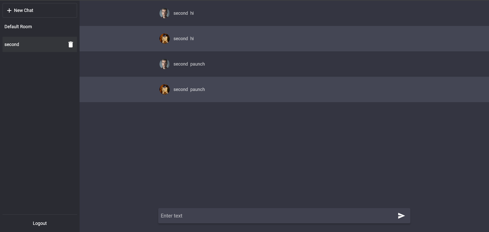
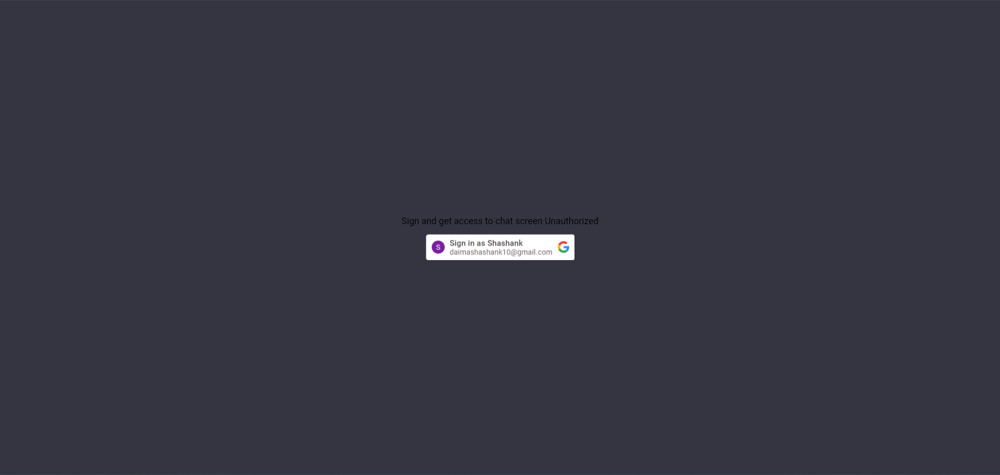
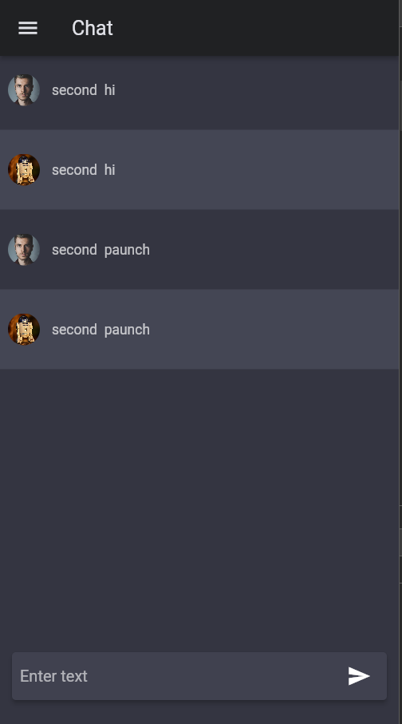
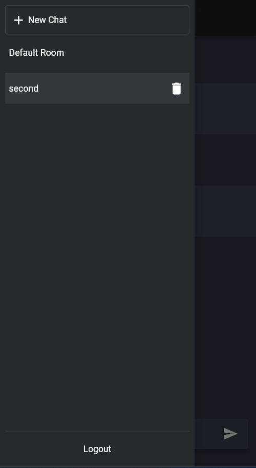

# Flutter Chat App

A modern chat application built using Flutter and Bloc for state management. This app includes authentication, chat rooms, and real-time messaging.

## Features

- A rudimentary User Authentication with Google
- Chat Rooms 
- Real-Time Messaging(build natively using method channels)
- Responsive UI
- Local Sessions Caching (build using Local Storage using `dart:html`)

## Screenshots

<!-- Add your screenshots here -->

### Desktop View

| Chat Interface | Sign Up Page |
| --- | --- |
|  |  |

### Mobile View

| Chat Interface Mobile | Drawer Menu Mobile |
| --- | --- |
|  |  |


## Getting Started

### Prerequisites

Ensure you have the following installed:

- [Flutter SDK](https://flutter.dev/docs/get-started/install)
- [Dart](https://dart.dev/get-dart)
- A code editor like [Visual Studio Code](https://code.visualstudio.com/) or [Android Studio](https://developer.android.com/studio)

### Installation

1. Clone the repository:

    ```sh
    git clone https://github.com/shashankdaima/chatapp.git
    cd chatapp
    ```

2. Install dependencies:

    ```sh
    flutter pub get
    ```
3. Run the app:

    ```sh
    flutter run
    ```

### Directory Structure

```
ChatApp
├── README.md
├── analysis_options.yaml
├── devtools_options.yaml
├── lib
│   ├── db
│   │   ├── db.dart
│   │   ├── entities.dart
│   │   ├── entities.g.dart
│   │   └── queries.dart
│   ├── features
│   │   ├── home
│   │   │   ├── chatBloc
│   │   │   │   ├── ChatBloc.dart
│   │   │   │   ├── ChatEvent.dart
│   │   │   │   └── ChatState.dart
│   │   │   ├── chatRoomBloc
│   │   │   │   ├── ChatRoomBloc.dart
│   │   │   │   ├── ChatRoomEvents.dart
│   │   │   │   └── ChatRoomState.dart
│   │   │   ├── home.dart
│   │   │   └── widgets
│   │   │       ├── chat.dart
│   │   │       ├── inputBox.dart
│   │   │       └── sidePanel.dart
│   │   └── signup
│   │       ├── cubit
│   │       │   ├── auth_cubit.dart
│   │       │   └── auth_state.dart
│   │       └── signup.dart
│   ├── main.dart
│   ├── resources
│   │   ├── colors.dart
│   │   ├── constants.dart
│   │   └── lengthcontraints.dart
│   ├── services
│   │   └── websocket.dart
│   ├── theme.dart
│   └── widgets
│       └── button.dart
├── pubspec.yaml
└── web
    ├── favicon.png
    ├── icons
    │   ├── Icon-192.png
    │   ├── Icon-512.png
    │   ├── Icon-maskable-192.png
    │   └── Icon-maskable-512.png
    ├── index.html
    ├── manifest.json
    └── ws.js
```
